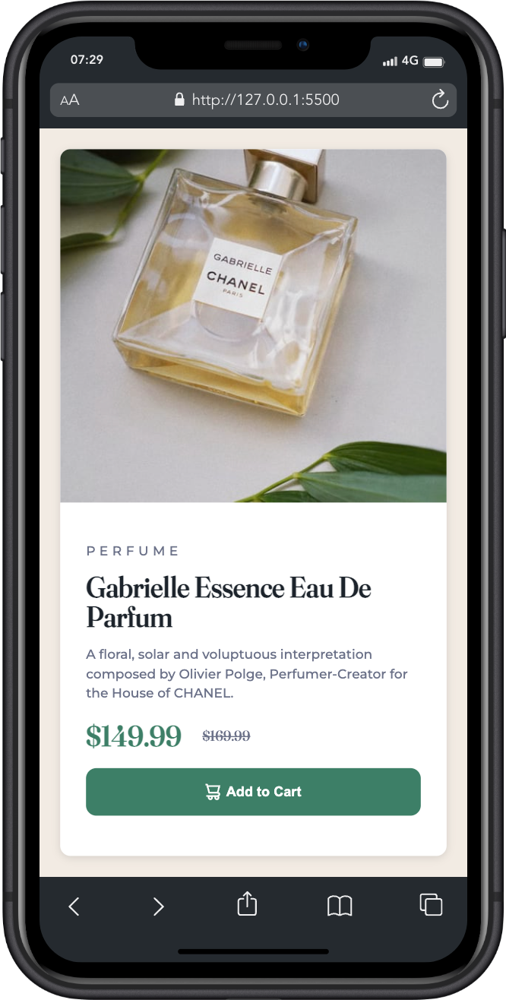

# Frontend Mentor - Product preview card component solution

This is a solution to the [Product preview card component challenge on Frontend Mentor](https://www.frontendmentor.io/challenges/product-preview-card-component-GO7UmttRfa). Frontend Mentor challenges help you improve your coding skills by building realistic projects. 

## Table of contents

- [Overview](#overview)
  - [The challenge](#the-challenge)
  - [Screenshot](#screenshot)
  - [Links](#links)
- [My process](#my-process)
  - [Built with](#built-with)
- [Author](#author)

## Overview

### The challenge

Users should be able to:

- View the optimal layout depending on their device's screen size
- See hover and focus states for interactive elements

### Screenshot

### Links

- Solution URL: [GitHub](https://github.com/JainamParikh0825/a-product-preview-card)
- Live Site URL: [Live](https://jainamparikh0825.github.io/a-product-preview-card/)

## My process

### Built with

- CSS custom properties
- Flexbox
- Mobile-first workflow
- Media Queries
- Psuedo classes

## Author

- Frontend Mentor - [@JainamParikh0825](https://www.frontendmentor.io/profile/JainamParikh0825)
- LinkedIn - [@jainam-parikh](https://www.linkedin.com/in/jainam-parikh/)
